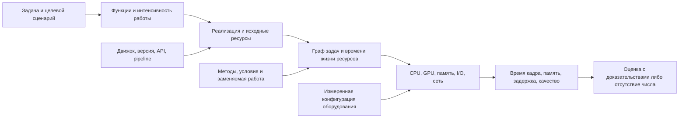

# Предметная модель, параметры и связи

Статус: семантический разбор обозначенных областей; индивидуальная проверка источников каждого метода и каждой связи метод–инструмент не завершена. Схемы с точными текущими типами, default, enum и границами находятся в `profile-schema.json` и `orm-schema.json` запуска 02. `profile-usage.json` содержит строки использования, но текстовое совпадение не доказывает прохождение данных по всем ветвям.

## Терминология и причинная структура

Функция — поведение, которое необходимо игре. Реализация — конкретный способ получить поведение. Оптимизация меняет затраты реализации при заданном контракте качества/поведения. Инструмент движка — средство runtime, подготовки, редактора или диагностики. Аппаратная возможность — проверяемое условие исполнения. Метод может обеспечивать несколько функций, иметь несколько этапов и ресурсов эффекта.

Стрелки обозначают зависимости проектируемой модели, не доказанную реализацию всех этих зависимостей в MVP. «Высокая графика» не определяет единственную нагрузку, а «оптимизировано» без исходной реализации не задаёт экономию.

## Паспорта 41 поля анкеты

Общее правило происхождения сейчас: значения поступают через API или default; происхождение отдельного значения не хранится. Значения null/auto/unknown не являются измерениями. Ниже — смысл и последствия; точные текущие ограничения не переписаны вручную, чтобы не разойтись с сохранённой JSON Schema.

| Поле | Смысл / единица | Связи, ограничения и решение для дальнейшей спецификации |
|---|---|---|
| name | Название, строка | Идентификация/сохранение; не коэффициент нагрузки. Короткая анкета |
| format | 2D/2.5D/3D | Фильтр решений и модель; 2D не гарантирует низкий overdraw/CPU. Короткая |
| world_type | Организация мира | Связан со streaming/применимостью; открытый мир не равен всему миру в памяти. Короткая |
| scale | Относительный масштаб | Сейчас напрямую влияет на content. Нужен смысл относительно активной сцены; unknown не превращать в измеренный масштаб. Короткая |
| stage | Стадия разработки | Применимость/late cost/план; стадия сама не должна менять физическую стоимость одинакового кадра. Короткая |
| engine | Код движка | Каталог/применимость/инструменты. Одинаковые текущие расходы памяти не подтверждены для всех движков. Короткая |
| engine_version | Версия, nullable | Связана с доступностью конкретных реализаций. null не означает последнюю версию. Уточнение |
| platforms | Набор платформ | Совместимость. Численная область Windows/Linux PC; общий результат для нескольких платформ требует отдельных сценариев. Короткая |
| object_count_level | Качественный уровень | Fallback при отсутствии числа. unknown сейчас даёт 0.55; это допущение, не наблюдение. Требует определения объекта. Короткая |
| object_count | Число объектов | Ноль отличается от отсутствия. Меняет level и effective; разрыв R01, насыщение R05. Разделить существующие/активные/видимые. Уточнение |
| npc_count_level | Уровень количества NPC | Не задаёт частоту AI, число костей, сложность пути. unknown сейчас заменяется индексом. Короткая |
| npc_count | Число NPC | Логарифмический индекс не описывает число активных задач. Разделить visible/active/simulated, не считать их автоматически равными. Уточнение |
| player_count | Игроки, count | Не число камер и не обязательно число видимых/релевантных игроков. Сеть зависит от топологии, частот, состояния. Уточнение для multiplayer |
| multiplayer | Наличие сети, bool | Активирует сетевой сценарий, но не определяет dedicated/server/host. Короткая |
| local_view_count | Локальные виды, count/null | С камерой связано несколько проходов, но экран не обязательно дублируется в полном разрешении; общие ресурсы могут переиспользоваться. Уточнение |
| functions | Коды поведения | Включение функции не содержит интенсивности. Оптимизацию штатной реализации нельзя начислять второй раз. Короткая |
| target_resolution | Выходное разрешение | Разделить output/internal/shadow/RT buffers. Изменение output не означает одинаковое изменение всех проходов. Короткая |
| target_quality | Preset внутри игры | Не абсолютный объём текстур или сложность шейдеров. Без resource profile недостаточен для сопоставления разных игр. Короткая |
| target_fps | Целевая частота, Hz | Текущий смысл при FG связан с display; целевой основной критерий должен явно быть base FPS. Бюджет 1000/FPS — ms. Короткая |
| render_api | API/auto | Условия возможностей и драйвера; auto не подтверждает D3D12/Vulkan и расширения. Уточнение |
| storage_type | Класс накопителя/auto | Класс не задаёт latency/IOPS/decompression. Сейчас качественный класс меняет CPU streaming через экспертный фактор. Уточнение |
| memory_model | auto/dedicated/unified | Определяет способ разделения ресурсов; unified не даёт скидку без бюджета общей памяти. Уточнение |
| upscaling_method | Метод/auto | Масштаб внутреннего рендера и цена восстановления — разные величины; нужны preset/version и целевые проходы. Уточнение |
| network_topology | Топология/auto | CPU роли, fan-out, bandwidth, determinism. Не выводить topology из числа игроков. Уточнение |
| frame_generation | FG, bool | Синтез кадров и задержка отдельно от base render. Bool не задаёт поколение метода, множитель и оверхед. Уточнение |
| base_render_fps | Базовая частота/null | При FG отличие от display; null не позволяет оценить число генерируемых кадров достоверно. Уточнение |
| streaming_pool_gb | Пул, GB с неуточнённым основанием | Сейчас влияет на RAM и половину значения VRAM. Нужно определить владельца пула, ресурс, reservation/resident и единицы bytes. Уточнение |
| draw_call_budget | Допустимый максимум calls/frame | Бюджет, не замер фактических вызовов. Использовать для проверки превышения, не заменять им нагрузку. Уточнение |
| simulation_radius_m | Радиус, m | Радиус не задаёт плотность, видимость или количество активных сущностей; текущая добавка ограничена экспертным cap. Уточнение |
| physics_tick_hz | Частота физики, Hz/null | Связать с работой шага, активными телами и catch-up. Не масштабировать напрямую display FPS. Уточнение |
| audio_complexity | Уровень/null | Требуются голоса, spatialization, effects, streaming. Уровень сейчас используется как экспертная добавка и CPU, и RAM, без общего физического основания. Уточнение |
| ram_limit_gb | Ограничение RAM | Не потребление. Отделить установленную ёмкость от доступного приложению бюджета. Уточнение |
| vram_limit_gb | Ограничение VRAM | Не рабочий набор. Nullable отдельно от нуля/неизвестной вместимости. Уточнение |
| size_limit_gb | Предел сборки | Не RAM/VRAM. Сжатие меняет загрузку/декомпрессию; грубый порог в применимости нуждается в отдельном основании. Уточнение |
| deadline_weeks | Время проекта, недели | Не CPU workload. Проверять наблюдаемость и связь с планом; не переводить балл сложности в недели без модели трудозатрат. Уточнение |
| complexity_tolerance | Допустимая сложность, ordinal | Фильтр; расстояния шкалы 1–5 не измерены. Не дублировать тот же показатель в нескольких критериях скрыто. Короткая/уточнение |
| priority | Приоритет ранжирования | Политика выбора весов, не физическое свойство игры. Короткая |
| cpu_budget | Качественный бюджет CPU | Ограничение/важность дефицита; не скорость процессора и не объём работы. Уточнение |
| gpu_budget | Качественный бюджет GPU | Не измеренный raster/RT score. Уточнение |
| ram_budget | Качественный бюджет RAM | Не заменяет bytes и не описывает пики. Уточнение |
| vram_budget | Качественный бюджет VRAM | Не заменяет конфигурацию dedicated/shared. Уточнение |

Дополнительные необходимые понятия пока не поля готового API: частота AI/network/simulation; активная область и роли сущностей; фактические draw calls; внутреннее разрешение; перечень ресурсов и время жизни; базовая реализация и уже включённые оптимизации. Для короткой анкеты неизвестные величины разрешены; неподтверждённые диапазоны не придумываются.

## Реализации и последствия

| Семейство | Удаляемая/заменяемая работа | Новые затраты и условия | Что нужно проверять |
|---|---|---|---|
| Culling | Работа невидимых объектов | Тесты видимости, структуры, задержка результатов; мелкая сцена может не окупать отсечение | CPU/GPU до/после, false occlusion, частота обновления и движение камеры |
| LOD/HLOD/impostors | Детальная дальняя геометрия/материалы | Хранение представлений, build, переходы, тени; текстуры могут вырасти | Силуэт, расстояние/экранная ошибка, overdraw, память всех уровней |
| Batching/instancing | Подготовка/переключения/повторные ресурсы | Условия материалов и мешей, instance buffers; ручное объединение ослабляет отсечение [S07,S08] | Draw/state changes, работа CPU, видимость, память |
| Streaming/virtual texturing | Постоянная резидентность всего контента | I/O, page tables, cache misses, decompression, staging, pop-in | Resident и peak отдельно; холодный и тёплый кэш; latency и burst |
| Compression | Байты хранения/передачи | Encode/decode, артефакты, случайный доступ; hardware format и архивное сжатие различны | Формат/качество, bytes, CPU/GPU decode, peaks |
| Caching/pooling | Повторные вычисления/аллокации | Сохранённые объекты, invalidation, lifetime; постоянная RAM может вырасти | Cache hit/miss, длительность пауз, correctness и retained memory |
| Precompute/baking | Часть runtime-работы | Build time, данные, ограничения изменения сцены; разные этапы эффекта | Поведение динамических объектов, загрузка, размер и качество |
| CPU→GPU перенос | Задачи CPU | GPU compute, буферы, синхронизация, readback; bottleneck может переместиться | Критический путь, contention, readback latency |
| Temporal/upscaling/FG | Изменение рендер-разрешения либо синтез | History, motion vectors, восстановление, disocclusion, задержка | Base/display FPS, качество в движении; не суммировать с denoising как синонимом |
| Tick/update budgeting | Число обновлений в секунду | Реакция/точность поведения, возможная рассинхронизация | Среднее и worst-step, deterministic replay, требования игрового поведения |

Эта таблица — анализ семейств. Она не заменяет индивидуальные условия всех 111 методов; проценты из текущих карт эффектов остаются экспертными утверждениями.

## Индивидуальный разбор 20 записей связей

Каждая строка соответствует существующей записи seed. Решения ниже — исследовательские заключения/вопросы, исходные записи не менялись. Где первоисточник пары не проверен, явно указано «предварительно». Любой количественный совместный эффект пока не установлен.

| № | Пара и текущий тип | Результат рассмотрения, условия и последствия |
|---|---|---|
| 1 | lightmap_atlas_baking → hardware_raytraced_gi, hard_conflict | Универсальный запрет недостаточно обоснован. Нужны конкретные pipeline, вклад освещения, поверхности, источники и fallback. S18 подтверждает возможность смешивания baked/realtime вообще, не эту конкретную RT-пару. Предварительно: запрещать только доказанное двойное освещение одной составляющей |
| 2 | gpu_procedural_placement → lightmap_atlas_baking, hard_conflict | Условие должно относиться к runtime-размещённой геометрии и заранее вычисленным UV/свету; запечённая статическая часть мира может оставаться. Предложенные в самой записи зонды означают альтернативный путь. Первичный источник конкретной комбинации ещё не проверен |
| 3 | cascaded_shadow_maps ↔ distance_field_shadows, complement | S14 подтверждает совместимость для directional light UE5.5 с подготовленными distance fields и разделением дистанций. Сохранить функциональное дополнение, не выдавать численную синергию и не переносить автоматически на другие движки |
| 4 | motion_matching ↔ animation_compression, hard_conflict | Текст описывает риск сильного сжатия, а не невозможность любого сжатия. Нужны допустимая ошибка признаков/поз и используемый codec. Предварительно: условный риск, исследовать отдельно feature database и воспроизведение анимации |
| 5 | static_shadow_caching ↔ hardware_raytraced_gi, hard_conflict | «RT всегда полностью динамический» не доказано. Нужны источник света, shadow backend и invalidation. Кэш статических теней и иной GI не доказаны взаимоисключающими. Предварительно: условия/перекрытие вместо глобального запрета |
| 6 | virtual_texturing ↔ heightmap_compression, complement | Проверить, действительно ли сжимаемый heightmap хранится в этом VT-пуле и поддержан ли формат. Экономия tiles может добавить decode и не уменьшить физический cache allocation. Предварительно: условное сочетание, без перемножения процентов |
| 7 | gpu_particle_simulation ↔ particle_pooling, complement | Снижение CPU allocation и GPU simulation — разные задачи; определить, какие CPU/GPU объекты удерживает pool. Возможен рост retained memory. Предварительно: дополнение ресурсов/этапов, не гарантированная гладкость кадров |
| 8 | agent_update_budget ↔ crowd_instancing_impostors, complement | Видимость и простая картинка не доказывают незаметность редкого AI. Нужны расстояние, поведение, взаимодействие и latency. Предварительно: отдельные CPU/GPU эффекты, проверить концептуальные ограничения |
| 9 | network_relevancy_priority ↔ delta_compression_state, complement | Нужны размер реплицируемого набора, baseline, потери/появление объектов и full-state resend. Предварительно: допустимое сочетание; максимум эффективности и численная независимость не доказаны |
| 10 | skeletal_2d_deform → sprite_atlas_batching, dependency | По тексту атлас нужен для уменьшения draw calls, не для самой возможности деформации. Предварительно: рекомендация производительности вместо обязательной функциональной зависимости; проверить engine backend/materials |
| 11 | lightmap_2d_baking ↔ post_effect_selective, complement | Освещение и postprocess имеют разные проходы; обещание убрать остаточную GPU-нагрузку слишком сильное. Предварительно: совместимость при сохранении visual contract, без общего бонусса |
| 12 | skeletal_2d_deform ↔ sprite_sheet_compression, hard_conflict | Описан риск артефактов lossy-формата. Определить текстуру, UV, mip/filter, качество и codec. Предварительно: условный риск, не запрет всех видов сжатия |
| 13 | crowd_2d_instancing ↔ agent_update_budget, complement | Один batch не устраняет последствия редких обновлений поведения. Предварительно: разделить отрисовку и симуляцию, оценить отложенные события/взаимодействия |
| 14 | deterministic_lockstep ↔ multithreaded_physics_jobs, hard_conflict | Результат зависит от детерминированности алгоритмов и порядка редукций, а не только факта потоков. Сама resolution допускает детерминированный планировщик. Предварительно: явное требование deterministic replay, тест разных расписаний |
| 15 | ml_frame_generation ↔ client_prediction_reconciliation, hard_conflict | «В competitive играть нельзя» и «Reflex обязателен» не доказаны ссылкой Wikipedia. Задать бюджет input latency, реализацию FG и требования продукта. Предварительно: риск/политика режима, не техническое взаимоисключение |
| 16 | pso_precaching_warmup ↔ async_loading_pipeline, complement | Убираются разные возможные причины hitch, но остаются missing PSO, IO/decode, shader variants, contention. Предварительно: условное дополнение; обещание отсутствия фризов отклонить до измерений |
| 17 | quality_tier_scalability ↔ hardware_raytraced_gi, complement | Выбор tier переключает реализацию/функции; это сценарий качества, а не дополнительная скидка внутри неизменного RT-режима. Предварительно: несколько явно различных профилей и min-spec каждого |
| 18 | planar_reflection_budget ↔ screen_space_gi, hard_conflict | В описании смешаны indirect illumination и reflections. Требуется определить, какую компоненту заменяет каждый проход и где. Предварительно: запрет не применять без конкретного пересечения; дополнительный проход сам по себе не конфликт |
| 19 | temporal_upscaling ↔ hardware_raytraced_gi, complement | Upscaling и denoising не считать тождественными. Нужны внутреннее разрешение, история, motion vectors, используемый denoiser. Предварительно: совместимость по реализации; обязательность пары и фиксированный выигрыш не подтверждены |
| 20 | tiled_clustered_light_culling ↔ depth_prepass_early_z, complement | Конкретная depth-based реализация может потребовать depth input, но вся категория clustered lighting не определена этой записью. Полный текст указанной статьи недоступен (403). Статус неизвестно; не превращать в обязательную связь до проверки алгоритма |

В текущем графе отсутствие записи не эквивалентно проверенной совместимости. Из 6 105 пар записи имеют 20, остальные 6 085 — неизвестные. Наличие общего ресурса у 1 649 пар задаёт очередь изучения, а не автоматический конфликт. Для тройки A/B/C попарная совместимость не исключает общий дефицит памяти или несовместимый выбор pipeline. Dependency направлена; остальные отношения могут иметь направленные условия или симметричную семантику — это надо хранить явно.

## Прослеживаемость и текущие границы

Прочитанный основной путь: DEFAULT_PROFILE / экраны → `api.recommend` с JSON profile/basket → BasketRequest/ProjectProfile и валидаторы → проверка движка → `recommender.build_recommendations` → `rules.evaluate` / `assess_selected_methods` → `hardware.build_model` / TOPSIS → RecommendationResult → экраны результата и история версий.

Уже есть положительные изменения: TOPSIS группируется по функции; несколько CPU/GPU подсистем разделены; snapshot проверяется на соответствие анкете/корзине; fingerprint канонизирует порядок функций/платформ и алиас 4k; область эффекта не сводится к клиенту автоматически. Старые D/G/N, утверждавшие обратное, нельзя повторять как актуальные без проверки.

Существование ProjectFile и VersionHistory не доказывает доступность импорта/экспорта/сохранения в текущем пользовательском маршруте. Полная проверка UI-пути, сохранения каждого поля и миграций остаётся открытой. Аналогично схема MethodOut не полностью равна ORM Method: например, внутренние source_date/min_scale и публичные поля требуют явной карты назначения, а не автоматического требования экспортировать каждое внутреннее поле.
